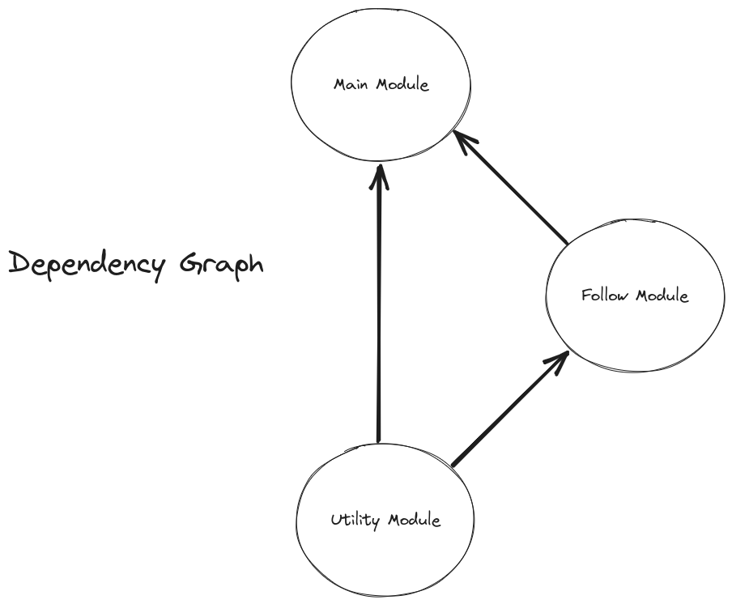
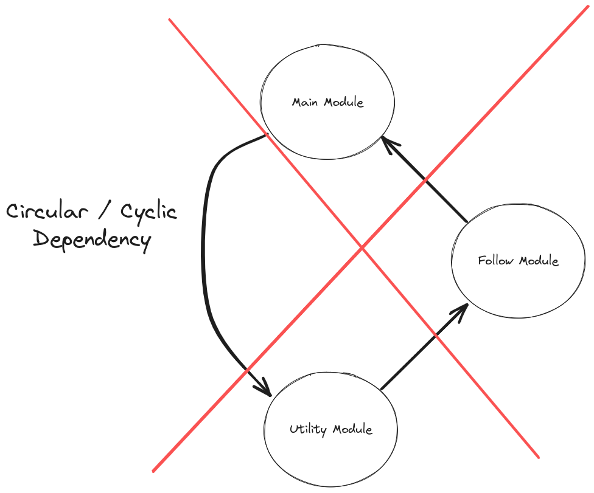

# A Basic Modul Example<br>*- Or package or library or reusable-bits-of-code*

## Content

- [About](#about)
- [Patterns](#patterns--common-ways-to-solve-common-problems)
  - [Decorater Pattern](#decorater-pattern--adding-functionality-to-functions)
  - [Factory Pattern](#factory-pattern---or-constructor-pattern-or-module-pattern)
  - [Option Object](#option-object--way-of-providing-configurations)
  - [Documentation](#jsdoc--documenting-your-code-for-future-you)
- [Code Dependendencies](#code-dependencies--seeing-the-relationships-between-bits-of-code)

## About

This does not purport to be a good example of which module one should make, rather it aims to be a good example of how to structure an application with modules. In addition to provide some patterns and how to apply them for solving a problem.

The code is on the more commenty side, if you are having trouble seeing what is actually happening, I suggest you delete the comments from the interior of the functions. They are there to explain to newcommers what and why we are doing the various steps.

Another thing to take note of is the amount of comments in the submodules compared to the main module. The main module is there to compose a set of submodules into your specific application. While the submoduls (libraries / packages) are more generic and designed to be independent of this project. This means that they are likely to be taken from here and put to use in another codebase. Having them well documented and storing the documentation together with the code makes that process simpler, in addition to providing people new with enough information to quickly figure out how to use the module.

As a final word, this is not working correctly at the moment. The function in [main.js](main.js) that is used to calculate the rotation is not correct, see if you can fix it and make a pull request.
There are also some other elements that warrants a comment. See if you can find them and create an issue in the issue tracker.

## Patterns<br>*- Common ways to solve common problems*

Patterns are sets of constructs we use to solve problems which surface in a wide range of applications / systems.

Here is the selection that is used in this project. But there are far more out there.

**Collections of patterns**
- [**Gang of Four (GoF) Design Patterns \*Recommended**](https://www.digitalocean.com/community/tutorials/gangs-of-four-gof-design-patterns)
- Enterprise Integration Patterns (EIP)
- Martin Fowler's Patterns
- Service-Oriented Architecture (SOA) Patterns
- Microservices Patterns
- Security Patterns
- Concurrency Patterns
- Testing Patterns
- Domain-Driven Design (DDD) Patterns
- UI Design Patterns

### Decorater Pattern<br>*- Adding functionality to functions*

A way to create a new function from a function
with some extra variables or logic attached.

Inside [utilities.js](utilities.js) we are using this to
setup a throttling mechanic for a function. We are then using it inside [follow.js](follow.js) for the event handler for mouse move events.

```js
function decorate(func, staticValue) {
  return function(...args) {
    console.log("new function call")
    func(staticValue, ...args)
  }
}
```

### Factory Pattern <br>*- Or Constructor Pattern or Module Pattern*

Provides a way to create objects or encapsulating some
state and exposing some functions to interact with that state.

Inside [follow.js](follow.js) we are using it to store a set of functions
which are decorated with the the element they are associated with.
Later on we are looping through that list whenever the mouse moves.

```js
function createObject(initialState) {
  let state = [...initialState]

  function log() {
    state.forEach(item => console.log(item))
  }

  function mutate(newState) {
    state = [...newState]
  }

  return {
    log,
    mutate,
  }
}
```

Be a litle mindeful if you store some variables inside here. As it is easy to keep references to those around after they are not needed anymore, preventing the [Garbage Collector](https://developer.mozilla.org/en-US/docs/Web/JavaScript/Memory_management) from cleaning them up.
This leads to what we call [memory leaks](https://en.wikipedia.org/wiki/Memory_leak). It is especially easy to do this when working with event listners and calling these factories in a loop. If you have a look at the return value inside [follow.js](follow.js) you will see that we are returning a function we can call to remove the event listners we set up.

### Option object<br>*- Way of providing configurations*

When a function requires many arguments, or you think that you will add more options in the future, you can wrap everything up in a single object.
It is also an easy way to have some default, but overridable, values.

```js
function createNode(nodeType, options) {
  const defaultOptions = {
    class: "default-class",
  }

  const mergedOptions = {...defaultOptions, ...options}

  const node = document.createElement(nodeType)

  Object.keys(mergedOptions).forEach(key => {
    node.setAttribute(key, mergedOptions[key]);
  });

  return node
}
```

### JSDoc<br>*- Documenting your code for future you*

Documenting your code is important. [JSDoc](https://jsdoc.app/) provides a set of ways to do this through JSDoc strings. These comment strings are something VS Code and other IDEs can pick up on and provides you with feedback in the form of the various context menues and code suggestions.

This allows you to get documentation about how to use the functions without having to look at the source code and try to figure out / remember how it actually works.

```js
/**
 * Text which gets displayed when hovering over the function
 * 
 * @link [Link to documentation site](www.documentation.here)
 * 
 * @example Syntaxt highlighted example for how the function can be used
 * // greeting is "Greeting Greg of 25 summers"
 * const greeting = createGreeting("Greg", 25)
 * 
 * @param {string} name - Text which gets displayed when writing the name argument
 * @param {number} age - Text which gets displayed when writing the age argument
 * @returns {string} Displayed when you hover over the function
 */
function createGreeting(name, age)
```

As a bonus. If you write good documentation, you can point people to that first rather than spending your valuable time explaining how to use the things you create to each and everyone.
This also makes it invaluable when makin libraries that you want to share with others.

## Code Dependencies<br>*- Seeing the relationships between bits of code*

The example here is split up into three modules. Make note of which module depends on which. These are the ones importing other modules. We usually represent these relations between modules as a [Mathematical Graph](https://en.wikipedia.org/wiki/Graph_theory).



You do not want to create cyclical dependencies between two or more modules. These makes it hard to reason about and complicates further development. If you want more arguments [see here](https://chat.openai.com/share/e96ab90f-b3ca-43a5-a809-548511efd2d9).



### [Main Module](main.js)

Our main JavaScript file.
This is where the logic of our application lives.
This is also where we import and configures the other modules we import.

#### Dependants
- NONE

#### Dependencies
- [Follow Module](follow.js)
- [Utilities Module](utilities.js)

### [Follow Module](follow.js)

The logic for the effect resides here.
Internally it does not know of any specific DOM elements,
but rather takes anything it needs in as arguments to any functions it exposes.

#### Dependants
- [Main Module](main.js)

#### Dependencies
- [Utilities Module](utilities.js)

### [Utilities](utilities.js)

Set of utility functions which does not belong to anywhere specific.

The functions inside here are fine to put inside the other modules
if they are only used in a single place. If you look at the functions in
this example, you will see that they are rather generic.

- **mapRange** is only concerned with numbers.
- **throttle** can be used for any function you want to limit the call frequency for.

#### Dependants
- [Main Module](main.js)
- [Follow Module](follow.js)

#### Dependencies
- NONE